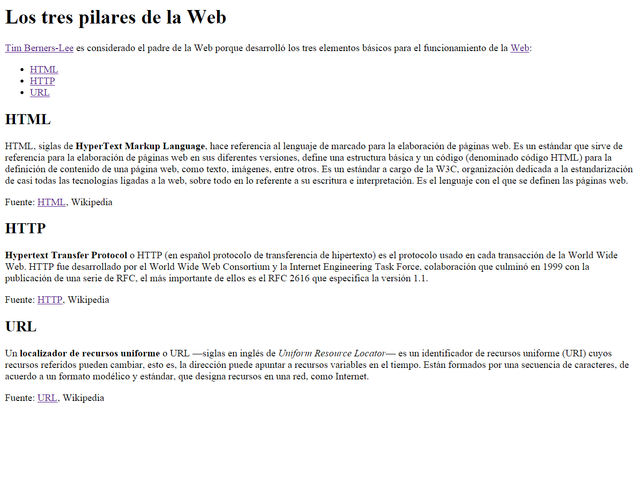

# Reto 1.3: Enlaces
## Instrucciones:
Nombre y Apellidos:
URL del repositorio de gitlab:
A partir del texto que se te proporciona, debes crear una página web que tenga el mismo aspecto que la siguiente imagen:

Además, tienes que tener en cuenta los siguientes requisitos:

El título de la página debe ser Los tres pilares de la Web.  
Los enlaces que aparecen en la página deben tener los siguientes destinos:  
Tim Berners-Lee → http://es.wikipedia.org/wiki/Tim_Berners-Lee  
Web → http://es.wikipedia.org/wiki/World_Wide_Web  
HTML → enlace intradocumental al epígrafe HTML  
HTTP → enlace intradocumental al epígrafe HTTP 
URL → enlace intradocumental al epígrafe URL  
Fuente: HTML → http://es.wikipedia.org/wiki/HTML  
Fuente: HTTP → http://es.wikipedia.org/wiki/Hypertext_Transfer_Protocol  
Fuente: URL → http://es.wikipedia.org/wiki/  Localizador_de_recursos_uniforme  